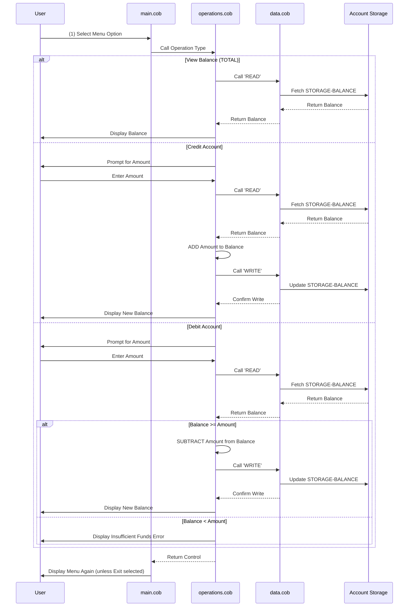

# School's Legacy COBOL Accounting System Documentation

## Overview

The school's accounting system is a legacy COBOL application designed to manage student accounts. It provides a menu-driven interface for performing basic banking operations including viewing balance, crediting accounts, and debiting accounts.

## System Architecture

The system follows a modular design with three main components:

### 1. **main.cob** - Main Program

**Purpose**: Provides the user interface and orchestrates the program flow

**Key Functions**:

- Displays a menu-driven interface for account management
- Accepts user input for operation selection (1-4)
- Routes user requests to appropriate operations
- Manages the main program loop until user exits

**Menu Options**:

- Option 1: View Balance
- Option 2: Credit Account
- Option 3: Debit Account
- Option 4: Exit Program

**Business Rule**: The system continues to loop until the user selects option 4 (Exit), ensuring continuous availability for multiple transactions.

---

### 2. **data.cob** - Data Management Module

**Purpose**: Handles all persistent data storage and retrieval for account balances

**Key Functions**:

- `READ` Operation: Retrieves the current account balance from storage
- `WRITE` Operation: Updates the account balance in storage

**Data Structures**:

- `STORAGE-BALANCE`: Stores the actual account balance (initial value: $1,000.00)
- Format: 9(6)V99 (numeric field with 6 digits and 2 decimal places)

**Business Rule**: Maintains a single account balance that persists across multiple operations within a program execution. Initial balance is set to $1,000.00.

---

### 3. **operations.cob** - Business Logic Module

**Purpose**: Implements the core accounting operations and business logic

**Key Functions**:

#### TOTAL Operation

- Retrieves and displays the current account balance
- Uses READ operation from DataProgram to fetch balance

#### CREDIT Operation

- Prompts user for the amount to credit
- Reads current balance
- Adds the credit amount to the balance
- Writes the updated balance back to storage
- Displays the new balance to the user

#### DEBIT Operation

- Prompts user for the amount to debit
- Reads current balance
- Validates sufficient funds (balance >= debit amount)
- If sufficient: Subtracts amount and writes new balance
- If insufficient: Displays error message without processing
- **Critical Business Rule**: Prevents overdrafts - transactions are rejected if they would result in a negative balance

**Error Handling**:

- Invalid menu selections are rejected with an error message
- Debit operations validate against overdraft conditions

---

## Data Flow Diagram

---

## Key Business Requirements

1. **Account Balance Management**: System maintains a single student account with a starting balance of $1,000.00
2. **Overdraft Protection**: The system prevents transactions that would result in negative balances
3. **User Interaction**: Menu-driven interface for easy operation
4. **Data Persistence**: Within a program run, all balance changes are retained and available for subsequent operations
5. **Operation Logging**: All operations display the resulting balance to provide confirmation to users

---

## Technical Notes

- **Language**: COBOL (legacy language from 1960s-1970s era)
- **Module Communication**: Uses the LINKAGE SECTION for inter-program communication via CALL and USING statements
- **Data Format**: All currency values use COBOL numeric format with 6 integer digits and 2 decimal places
- **Program Flow**: Main program controls the overall flow while delegating to specialized modules for operations and data management

---

## Modernization Considerations

This system is a candidate for modernization due to:

- Use of legacy COBOL language
- Limited error handling and validation
- Lack of persistent data storage (in-memory only)
- Single-account limitation
- Manual menu navigation required
- No logging or audit trail capabilities
